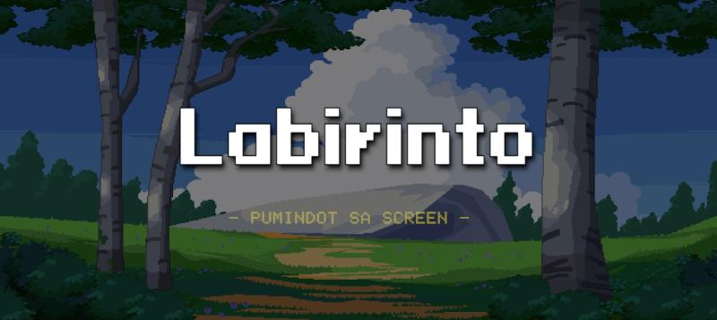
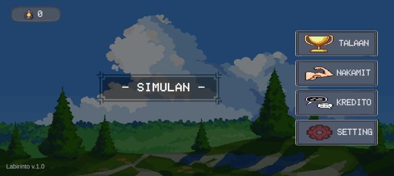
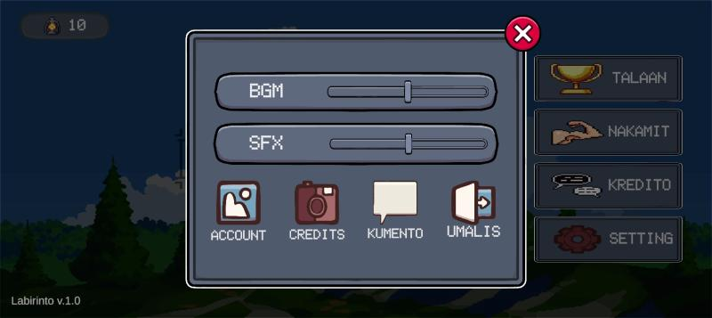
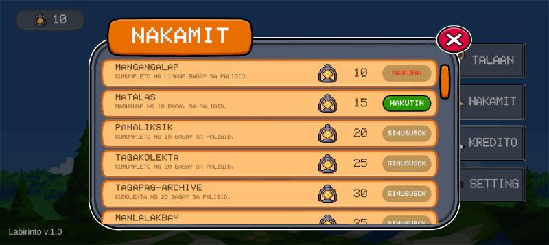
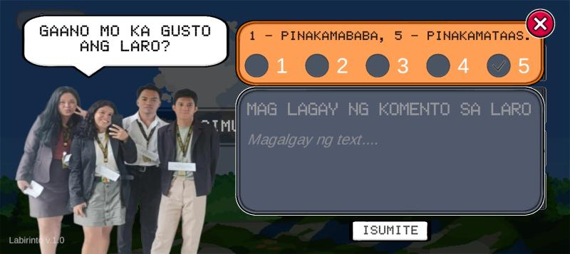
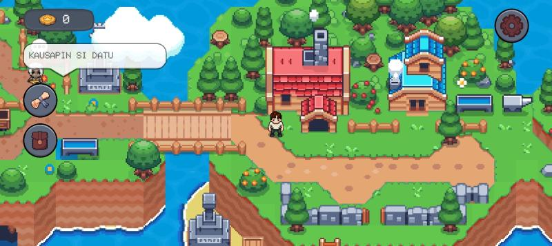
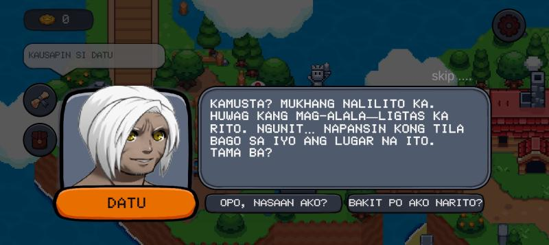
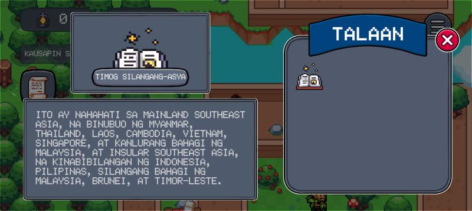
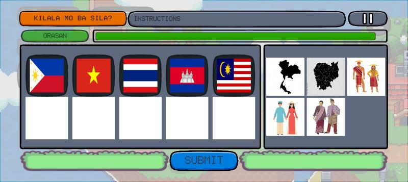

# 🎮 Labirinto: An Interactive Game-Based Learning for Araling Panlipunan 7

**Labirinto** is our **Capstone Project**, developed as an educational mobile game aimed at helping Grade 7 students learn Araling Panlipunan through interactive storytelling and gameplay.

🔗 **Game APK:** [Labirinto](https://drive.google.com/file/d/17xA5aaI9zCZuDVJ3vK2VMhFDE5XXfwiK/view?usp=drive_link)

---

## 📸 Game Screenshots

  
  
  

  
  
  

  
  
  

---

## 🎯 Making Learning Engaging Through Game-Based Education

Labirinto: An Interactive Game-Based Learning Tool for Araling Panlipunan 7 is an innovative top-down 2D RPG adventure mobile game developed as a supplementary educational tool to enhance student engagement and comprehension in Araling Panlipunan. Designed for Grade 7 students and aligned with the MATATAG Curriculum, the game addresses common challenges in traditional teaching methods, such as a lack of interest and difficulties in understanding historical concepts.

---

## 🧩 Game Features

- 🗨️ Interactive dialogues  
- 📖 Story-driven quests  
- 🗺️ Large explorable map  
- 🌀 Maze challenges  
- 🏆 Achievements  
- 📊 Leaderboard  

---

## 📦 Tech Stack

  

---

## 📄 License

This project is open source and available under the [MIT License](LICENSE).
